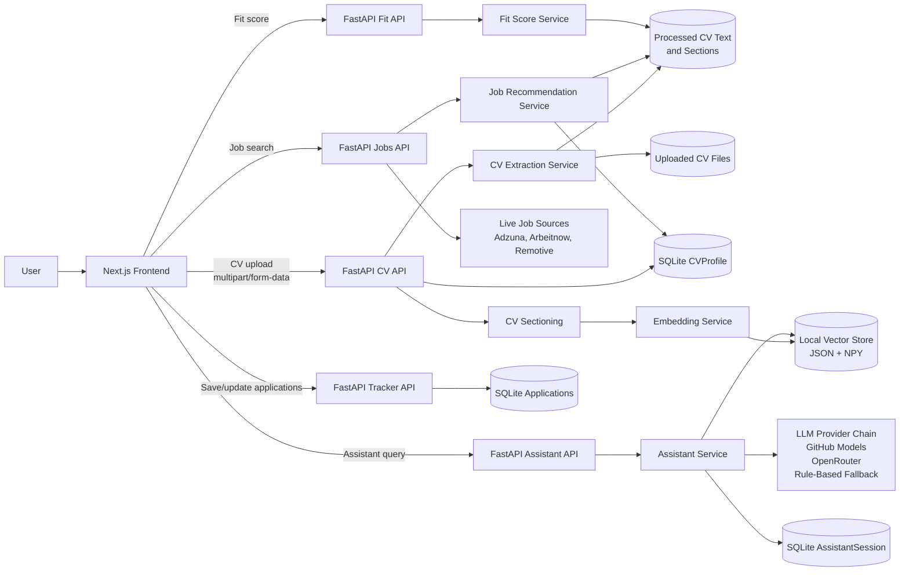
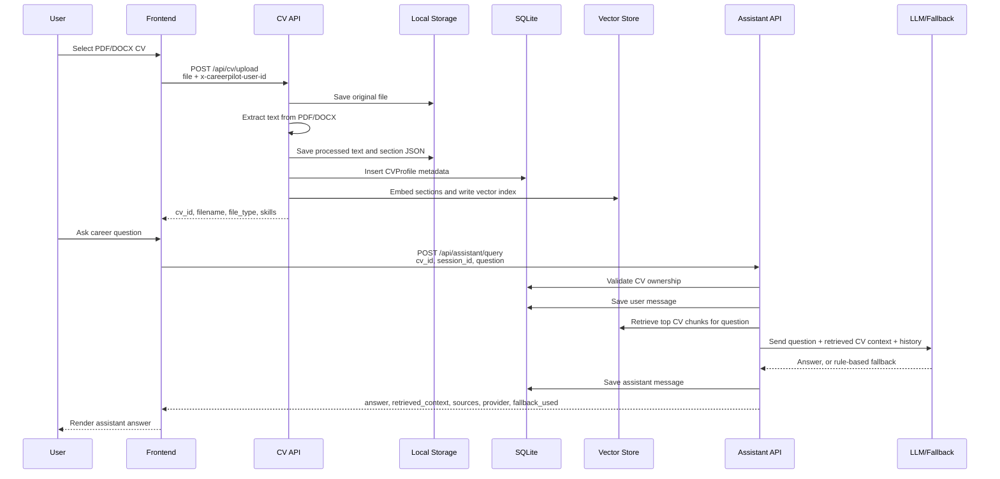
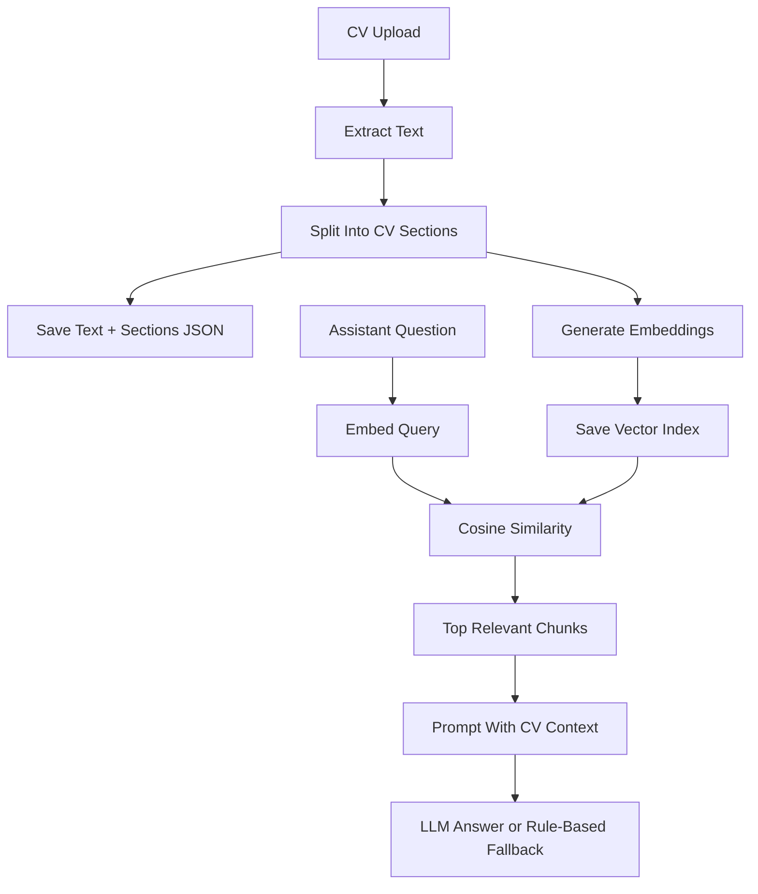
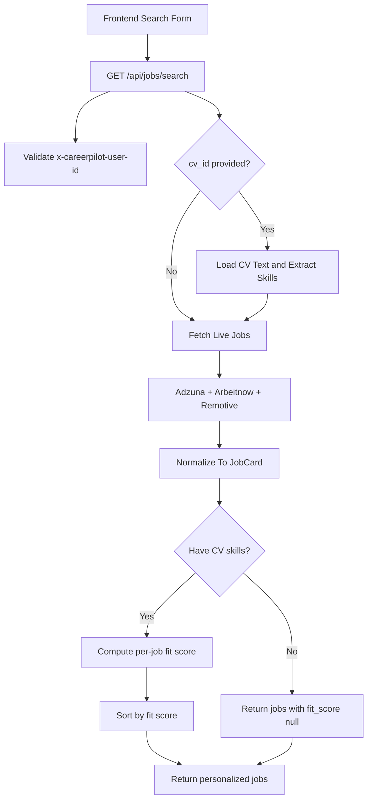
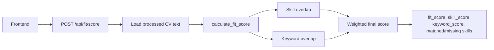
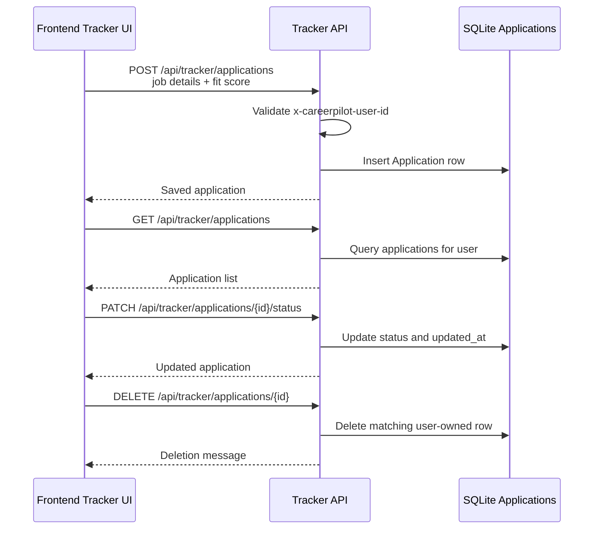

# CareerPilot System Architecture

CareerPilot is a local-first career assistant with a Next.js frontend and a
FastAPI backend. The backend stores uploaded CVs, extracts searchable context,
builds a local vector index for RAG, searches live job sources, scores CV/job
fit, and persists tracker data in SQLite.

## High-Level Architecture

## Main Components

| Layer | Component | Responsibility |
| --- | --- | --- |
| Frontend | `frontend/` Next.js app | Upload CVs, search jobs, ask assistant questions, display fit scores, manage tracker UI. |
| API | `backend/app/main.py` | Registers FastAPI routers and configures CORS. |
| API routes | `backend/app/api/*_routes.py` | Request validation, user header checks, and service orchestration. |
| Services | `backend/app/services/` | CV extraction, chunking, embeddings, vector retrieval, LLM calls, job search, fit scoring. |
| Database | SQLite at `backend/app/storage/careerpilot.db` | CV metadata, applications, todos, calendar events, assistant sessions. |
| File storage | `backend/app/storage/` | Uploaded CVs, processed CV text/sections, vector index metadata and embeddings. |
| External APIs | Adzuna, Arbeitnow, Remotive, GitHub Models, OpenRouter | Job search and AI generation providers. |

Most user-specific endpoints use `x-careerpilot-user-id` to isolate local
profiles without a full authentication system.

## CV Upload To Agent Response Data Flow

The upload response gives the frontend a `cv_id`. That ID becomes the join key
for assistant questions, fit scoring, RAG retrieval, and personalized job
recommendations.

## RAG Pipeline

RAG is built around local CV content rather than a remote vector database.

1. The frontend uploads a CV to `POST /api/cv/upload`.
2. `cv_extraction_service` extracts readable text from PDF or DOCX.
3. `cv_chunking_service.save_processed_cv` writes:
   - `backend/app/storage/processed_cvs/{cv_id}.txt`
   - `backend/app/storage/processed_cvs/{cv_id}_sections.json`
4. The section splitter groups content into `skills`, `education`,
   `experience`, `projects`, and `other`.
5. `vector_store_service.build_cv_rag_index` embeds section text through
   `embedding_service`.
6. The vector store writes:
   - `backend/app/storage/vector_db/{cv_id}.json`
   - `backend/app/storage/vector_db/{cv_id}_embeddings.npy`
7. Assistant queries call `retrieve_relevant_chunks(cv_id, query, top_k=3)`.
8. Retrieved chunks become `retrieved_context` and `sources` in the assistant
   response.

If the vector index is missing when an assistant query arrives, the assistant
service attempts to rebuild it from the saved CV section JSON before answering.

## Assistant And Agent Response Flow

`POST /api/assistant/query` coordinates the agent-like assistant behavior.

Request inputs:

- `cv_id`: uploaded CV identifier.
- `session_id`: conversation identifier.
- `question`: user question.
- `job_id`: optional tracked job context for readiness or skill-gap questions.
- `x-careerpilot-user-id`: local profile identifier.

Processing steps:

1. Validate that the CV belongs to the current `x-careerpilot-user-id`.
2. Persist the user message to `AssistantSession`.
3. Load recent conversation history from SQLite, with in-memory cache as a
   fallback.
4. Retrieve the top CV chunks from the vector store.
5. Optionally load tracked job data when `job_id` is supplied.
6. Generate an answer through the provider chain:
   - GitHub Models when `GITHUB_MODELS_TOKEN` is configured.
   - OpenRouter when `OPENROUTER_API_KEY` is configured.
   - Rule-based fallback when no provider is available or provider generation
     fails.
7. Persist the assistant answer to `AssistantSession`.
8. Return the answer, retrieved context, source chunks, provider name, and
   fallback flag.

## Job Search And Fit Scoring

### Job Search Flow

`GET /api/jobs/search` searches live job sources and optionally personalizes
results with CV skills.

Job source behavior:

- Adzuna is used when `ADZUNA_APP_ID` and `ADZUNA_APP_KEY` are configured.
- Arbeitnow is used as a no-key live source.
- Remotive is kept as another no-key source.
- Results are normalized into the shared `JobCard` shape and deduplicated by
  URL or `(company, role)`.

When `cv_id` is missing, the frontend receives general job results with
`personalized=false` and `fit_scores_enabled=false`. The UI should not display a
fit score in that state.

### Fit Scoring Flow

`POST /api/fit/score` compares a processed CV against a specific job posting.

The fit score service:

- extracts skills from the CV and job posting,
- calculates explicit skill overlap,
- calculates keyword overlap,
- combines the weighted components,
- returns matched skills, missing skills, matched keywords, and an explanation.

## Tracker Data Flow

The tracker stores selected jobs and their application state in SQLite.

Tracker records are keyed by the anonymous user header and include:

- external `job_id`
- role, company, location, deadline, and job URL
- saved job description and required skills
- application status
- fit score
- notes and timestamps

The common frontend flow is:

1. User searches jobs.
2. User reviews a job and optional fit score.
3. Frontend saves the job to `/api/tracker/applications`.
4. Tracker board loads saved jobs through `GET /api/tracker/applications`.
5. Status changes update the same record through the status endpoint.

## Persistence Summary

| Data | Stored In | Written By | Read By |
| --- | --- | --- | --- |
| Uploaded CV file | `storage/uploaded_cvs/` | CV upload API | Audit/debug, original file retention |
| Extracted CV text | `storage/processed_cvs/{cv_id}.txt` | CV chunking service | Fit scoring, job personalization, RAG rebuild |
| CV sections | `storage/processed_cvs/{cv_id}_sections.json` | CV chunking service | RAG build/rebuild, CV section endpoint |
| Vector metadata | `storage/vector_db/{cv_id}.json` | Vector store service | Assistant retrieval |
| Vector embeddings | `storage/vector_db/{cv_id}_embeddings.npy` | Vector store service | Assistant retrieval |
| CV metadata | SQLite `cv_profiles` | CV upload API | Ownership validation, job personalization |
| Assistant messages | SQLite `assistant_sessions` | Assistant service | Conversation history |
| Applications | SQLite `applications` | Tracker API | Tracker board, optional assistant job context |

## Operational Notes

- The backend creates SQLite tables at startup.
- CORS is controlled by `CORS_ORIGINS`; the local default is permissive.
- LLM provider status is available at `GET /api/health/providers`.
- The assistant can answer with a rule-based fallback when no LLM key is
  configured.
- Job search can return a successful `200` response with empty jobs and an
  `error` or `message` field when live sources fail or no results match.

