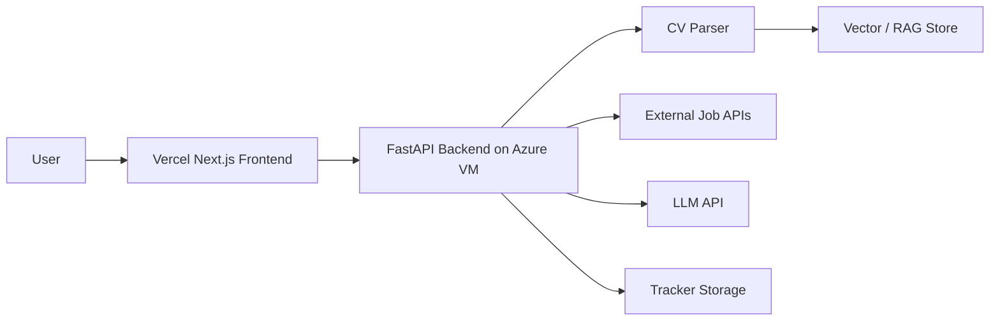
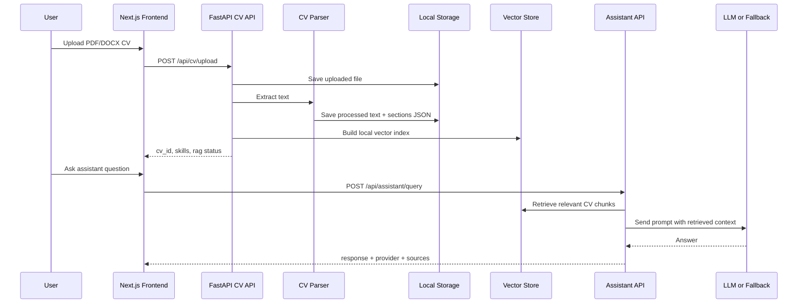
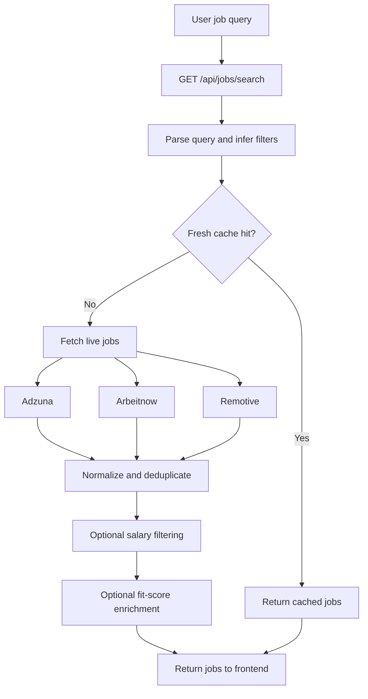

# CareerPilot Architecture

This document describes the current CareerPilot architecture as implemented in the repository. It is intentionally honest about MVP trade-offs: the app is deployable and demo-ready, but it is not a production-grade multi-region platform.

## High-Level Architecture

CareerPilot is a split web application:

- a Next.js frontend deployed on Vercel
- a FastAPI backend deployed on an Azure VM
- local backend persistence for CV files, processed artifacts, vectors, and SQLite data
- external job APIs for live job discovery
- hosted LLM providers with a built-in fallback path

## Main Runtime Components

| Component | Location | Responsibility |
| --- | --- | --- |
| Frontend pages | `frontend/src/app` | Upload, jobs, assistant, cover letter, tracker, productivity UI |
| Frontend API proxies | `frontend/src/app/api` | Forward browser requests to the backend via `BACKEND_URL` |
| FastAPI app | `backend/app/main.py` | Router registration, CORS, startup setup, health endpoints |
| API routes | `backend/app/api/*_routes.py` | Request validation and orchestration |
| Service layer | `backend/app/services` | CV extraction, chunking, embeddings, retrieval, LLM calls, fit scoring, job search |
| Database | `backend/app/storage/careerpilot.db` | CV metadata, tracker records, todos, calendar, assistant history, job cache |
| File storage | `backend/app/storage` | Uploaded CVs, processed CV text and section JSON, vector artifacts |

## Data Flow: CV Upload to AI Response

The uploaded CV becomes the core state object for the platform.

## CV Upload and RAG Pipeline

### CV upload flow

1. Frontend calls `POST /api/cv/upload`.
2. Backend validates file type and size.
3. `cv_extraction_service.py` extracts text from:
   - PDF via `pypdf`
   - DOCX via `python-docx`
4. `cv_chunking_service.py` stores:
   - raw processed text
   - section JSON
5. Skills are extracted from the CV text.
6. `vector_store_service.py` builds a local index from CV chunks.
7. Upload response returns `cv_id`, `skills`, and RAG status fields.

### Chunking strategy

Chunking is section-first, not purely fixed-window:

- `skills`
- `education`
- `experience`
- `projects`
- `other`

Longer sections are then split into smaller chunks for retrieval.

### Embeddings and retrieval

Primary embedding path:

- `sentence-transformers`
- model: `all-MiniLM-L6-v2`

Fallback embedding path:

- `scikit-learn` `HashingVectorizer`

Vector artifacts are stored in:

- `backend/app/storage/vector_db/{cv_id}.json`
- `backend/app/storage/vector_db/{cv_id}_embeddings.npy`

At query time:

1. the question is embedded
2. stored chunk vectors are loaded
3. cosine similarity is computed
4. top chunks are returned to the assistant or cover-letter flow

## Job Hunter Agent Flow

The job search pipeline is live-source based and supports natural-language search input.

Notes:

- Adzuna is only used when its credentials are configured.
- Arbeitnow and Remotive are keyless live sources.
- Results are normalized into a shared `JobCard` shape.
- Live results are cached in SQLite with a TTL.

## Fit Score Computation Flow

Fit score is computed programmatically rather than delegated to an LLM.

1. The backend extracts normalized skills from the CV.
2. It extracts required skills from the job posting.
3. It calculates matched and missing skills.
4. It computes a score based on overlap.
5. It returns both the numeric score and the structured evidence.

This separation is important because the visible score is deterministic and explainable.

## Assistant Flow

The assistant is a routed CV-grounded service.

1. Validate anonymous user id and CV ownership.
2. Load conversation history from SQLite.
3. Retrieve top CV chunks from the local vector store.
4. If the prompt is a job-hunter request, parse the natural-language job request and call live job search.
5. Otherwise send question plus retrieved context to the provider chain:
   - GitHub Models
   - OpenRouter
   - built-in fallback
6. Persist the assistant response.
7. Return answer, provider, fallback flag, and retrieved sources.

## Cover Letter Flow

1. User selects a job context.
2. Frontend calls the cover-letter route with CV id and job/job-description context.
3. Backend retrieves relevant CV chunks.
4. Backend combines:
   - user CV context
   - job title
   - company
   - job description
5. The provider chain generates a draft, or the built-in fallback produces a structured version.

## Tracker and Productivity Flow

Tracker data is persisted in SQLite and scoped by anonymous user id.

Implemented persistence flows include:

- application save and status updates
- tracker / Kanban board retrieval
- todo creation and completion
- calendar event CRUD
- assistant session history

The tracker workflow is:

1. user searches jobs
2. user saves a job to tracker
3. tracker record is written to SQLite
4. user updates stage in Kanban
5. updated state persists across reloads

## Storage Model

| Data | Storage |
| --- | --- |
| Uploaded CV files | `backend/app/storage/uploaded_cvs/` |
| Processed CV text | `backend/app/storage/processed_cvs/*.txt` |
| Processed CV sections | `backend/app/storage/processed_cvs/*_sections.json` |
| Vector metadata | `backend/app/storage/vector_db/*.json` |
| Vector arrays | `backend/app/storage/vector_db/*_embeddings.npy` |
| Structured app data | SQLite in `backend/app/storage/careerpilot.db` |

This local VM persistence was chosen for hackathon speed and simplicity.

## Deployment Architecture

### Frontend

- Hosted on Vercel
- Uses App Router pages
- Uses route handlers under `src/app/api/*`
- Reads `BACKEND_URL` to reach the backend

### Backend

- Hosted on Azure Ubuntu VM
- Runs `uvicorn app.main:app`
- Managed by `systemd`
- Typically reverse-proxied by `nginx`

### Operational endpoints

- `/health`
- `/api/health`
- `/api/health/providers`
- `/docs`

## Architectural Trade-offs

- Local filesystem storage is simple and demo-reliable, but not horizontally scalable.
- SQLite is easy to ship and inspect, but it is not ideal for large concurrency.
- Hosted LLMs improve quality, but the built-in fallback is necessary for judge/demo reliability.
- Local vector files reduce infrastructure complexity, but a managed vector database would be better at scale.
